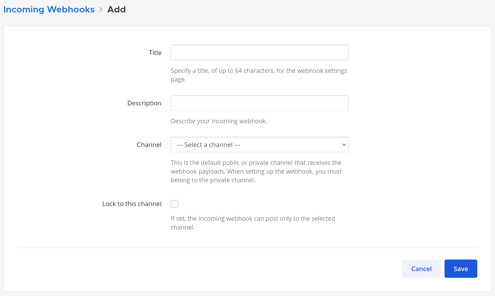
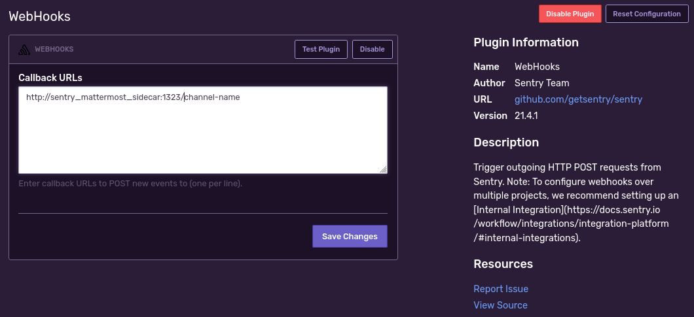
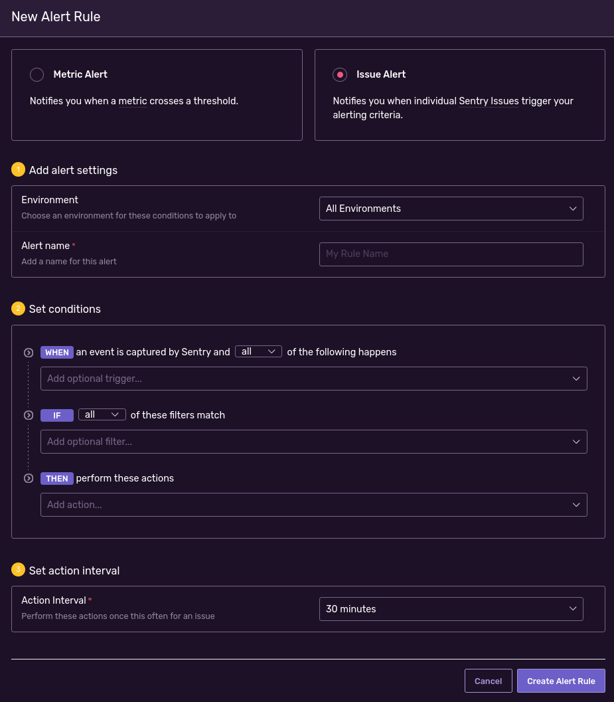

# sentry-mattermost-sidecar

This tools is a sidecar to use sentry webhook on mattermost.

## Roadmap

- [x] Handle sentry Issue alerts
- [ ] Handle sentry Metric alerts

## How to use

First you must create a [Mattermost incoming webhook](https://docs.mattermost.com/developer/webhooks-incoming.html)
integration.


Next you must deploy the [docker image](https://hub.docker.com/r/rpsl/sentry-mattermost-sidecar) (don't forget to
fill `SMS_MATTERMOST_WEBHOOK_URL` environment variable with the Mattermost webhook URL) somewhere and redirect sentry
webhook on it with route name defined as Mattermost channel for each projects.


Then you setup [sentry issue alerts](https://docs.sentry.io/product/alerts/) as you like.


## Getting started

You can build local binary or docker image with:

```sh
$ make build-bin
```

```sh
$ make build-docker
```

You can test an example sentry webhook with:

```sh
$ make test
```

## Deploy

This image is automatically deployed and versioned as a docker image
at [rpsl/sentry-mattermost-sidecar](https://hub.docker.com/r/rpsl/sentry-mattermost-sidecar).

```shell
docker run -d \
	--name sentry-mattermost-sidecar \
	-p 1323:1323 \
	--restart=always \
	-e SMS_MATTERMOST_WEBHOOK_URL="https://..." \
	-e SMS_HOST="127.0.0.1" \
	-e SMS_PORT="1323" \
	rpsl/sentry-mattermost-sidecar:latest
```

To deploy a new tag use [`./scripts/create-and-push-tag.sh`](scripts/create-and-push-tag.sh):

```sh
$ ./scripts/create-and-push-tag.sh 1.0.0
```